  

 

**[About](#-about)** &nbsp;·&nbsp;
**[ForgeGTM](#-building-forgegtm)** &nbsp;·&nbsp;
**[AI Journey](#-ai-engineering-journey)** &nbsp;·&nbsp;
**[Projects](#-projects)** &nbsp;·&nbsp;
**[Stack](#-ai--technology-stack)** &nbsp;·&nbsp;
**[Activity](#-activity)** &nbsp;·&nbsp;
**[Connect](#-connect)**

 

 

---

## 🧭 About

I'm building **ForgeGTM**, a B2B go-to-market and outbound agency — and I write the software that runs it.

Most outbound doesn't fail for lack of effort. It fails because the system behind it is broken: lists bought instead of researched, messaging written for nobody in particular, deliverability quietly failing while the dashboard looks fine. Those are **engineering problems as much as creative ones**, which is exactly why I ended up on both sides of the work.

So my days split between two things that keep turning out to be the same thing:

- **Designing the go-to-market motion** — ICP definition, buying-signal research, email infrastructure, campaign architecture, messaging that earns a reply.
- **Building the systems underneath it** — TypeScript, Next.js, Postgres, server actions, automated lead capture and notification, bilingual delivery, SEO infrastructure.

Next step is deliberate: taking the automation instinct that already drives how I build GTM systems, and developing it into real **AI engineering** capability. That part is early, and I've labelled it honestly below.

 

## 🔨 Building ForgeGTM

> **Qualified pipeline, built on outbound systems.**
> ForgeGTM builds and runs outbound for B2B companies — targeting, infrastructure, messaging and campaigns — so sales teams spend their time in qualified conversations instead of building lists.

**Who it's for:** B2B SaaS & technology · Series A–C · DACH, UK & Nordics

### The system, in three pillars

<table>
<tr>
<td width="33%" valign="top">

**`01` Strategy & Targeting**

Decide who is worth contacting before spending a euro reaching them.

Outbound Strategy · ICP & Targeting · Buying-Signal Research

</td>
<td width="33%" valign="top">

**`02` Infrastructure & Deliverability**

Make sure what you send actually reaches a human inbox.

Email Infrastructure · Deliverability · Campaign Strategy

</td>
<td width="33%" valign="top">

**`03` Messaging & Pipeline**

Turn attention into qualified conversations a team can close.

Personalized Copywriting · Lead Generation · Pipeline Generation

</td>
</tr>
</table>

### How an engagement runs

`01` **Research** — ICP, buying committee, live-signal accounts &nbsp;→&nbsp; *Week 1–2*
`02` **Build** — targeting, messaging, sending infrastructure, warm-up &nbsp;→&nbsp; *Week 2–4*
`03` **Launch** — campaigns live, replies routed, volume paced &nbsp;→&nbsp; *Week 5*
`04` **Optimize** — test against real reply data, expand what works &nbsp;→&nbsp; *Ongoing*

### What I've actually shipped for it

The ForgeGTM platform is a real production codebase, not a landing page:

- 🌍 **Fully bilingual (EN/DE)** — locale dictionaries type-locked to each other, so the build fails if a translation drifts out of sync
- 🗄️ **Postgres lead pipeline** — idempotent schema, documented migrations, indexed for the way the queue is actually read
- 📬 **Dual email transports** — Gmail SMTP *or* Resend, auto-selected by which credentials are present
- 🛡️ **Failure-tolerant by design** — internal alert and prospect confirmation tracked with separate timestamps, so a failed send never silently loses a lead
- 🔐 **Protected lead dashboard** — `/admin` behind HTTP Basic, `noindex`, never cached, and it 503s rather than falling open when unconfigured
- ✅ **Real server-side validation** — free-email-domain rejection, URL normalisation, typed per-field error keys
- 🔎 **Full SEO surface** — sitemap, robots, generated Open Graph images, canonical origins, hreflang alternates
- 📚 **8 long-form insight articles + 3 case studies**, written in both languages

⚖️ Every case study on the site is explicitly labelled as illustrative, and placeholder content carries a visible badge. I'd rather ship an honest placeholder than an invented client.

 

## 🤖 AI Engineering Journey

  

I'd rather state this plainly than decorate it: **I am not an AI engineer yet.** There is no AI code in my repositories, and I'm not going to badge myself with skills I can't show you. Here's the real state of it.

<table>
<tr>
<td width="33%" valign="top">

#### ✅ Building

*Shipped, and public.*

Production TypeScript · Next.js App Router · Postgres · server actions · automated email workflows · internal tooling · bilingual delivery

**Status:** live in `forgegtm`

</td>
<td width="33%" valign="top">

#### 📖 Learning

*In progress, no shipped artifact yet.*

Python for AI work · LLM APIs · prompt design · tool-calling and agent patterns · retrieval fundamentals

**Status:** learning, not claiming

</td>
<td width="33%" valign="top">

#### 🧭 Next

*Planned, not started.*

AI-assisted ICP research · agentic outbound workflows · RAG over sales knowledge · open-source AI tooling

**Status:** on the roadmap

</td>
</tr>
</table>

**Why this direction, specifically.** GTM is full of work that is judgement-heavy, repetitive, and text-shaped — qualifying accounts, reading buying signals, writing a relevant first sentence at scale. That's the exact shape of problem modern AI systems are good at. I'm not moving toward AI because it's the thing to do; I'm moving toward it because I keep hitting the wall where my GTM systems need it.

This section gets updated as things actually ship. If something is in **Learning** or **Next**, it means there is nothing to show yet.

 

## 🚀 Projects

<table>
<tr>
<td valign="top">

### ForgeGTM &nbsp;

**B2B go-to-market & outbound platform** — the marketing site, lead pipeline and internal tooling behind the agency.

**The problem it solves:** inbound enquiries arriving with no qualification, no storage, no alerting and no attribution — a lead landing in an inbox and dying there.

**What it does:** validates and stores every strategy-call request in Postgres, sends an internal alert *and* a prospect confirmation over two independent transports, tracks whether each one actually sent, and exposes the queue in a password-gated dashboard. Fully bilingual, fully SEO-instrumented.

`TypeScript` `Next.js 16` `React 19` `Tailwind v4` `PostgreSQL` `Nodemailer` `Resend` `Server Actions` `i18n`

**Status:** actively building · pre-launch
**→ [View repository](https://github.com/KathiriyaHardik/forgegtm)**

</td>
</tr>
</table>

Live from the repository — these numbers move on their own.

🧱 One project, shown properly — rather than a wall of empty repositories. More land here as they ship, not before.

 

## ⚡ AI & Technology Stack

#### Engineering — *shipping with this today*

#### Automation & Systems — *built into ForgeGTM*

#### GTM — *tools I work in on engagements*

#### AI — *learning, not yet shipping*

💡 The dimmed badges are deliberate. Everything above them is in a repository you can open; everything in that row is something I'm still learning.

 

## 📊 Activity

<picture>
  <source media="(prefers-color-scheme: dark)" srcset="https://github-profile-summary-cards.vercel.app/api/cards/profile-details?username=KathiriyaHardik&theme=github_dark" />
  
</picture>

 

<picture>
  <source media="(prefers-color-scheme: dark)" srcset="https://github-profile-summary-cards.vercel.app/api/cards/stats?username=KathiriyaHardik&theme=github_dark" />
  
</picture>
<picture>
  <source media="(prefers-color-scheme: dark)" srcset="https://github-profile-summary-cards.vercel.app/api/cards/most-commit-language?username=KathiriyaHardik&theme=github_dark" />
  
</picture>

 

<picture>
  <source media="(prefers-color-scheme: dark)" srcset="https://streak-stats.demolab.com?user=KathiriyaHardik&background=08080a&border=222227&stroke=222227&ring=2d5ef5&fire=2d5ef5&currStreakNum=ffffff&sideNums=ffffff&currStreakLabel=2d5ef5&sideLabels=8d919a&dates=62666e&border_radius=12" />
  
</picture>

  

<!-- CONTRIBUTION SNAKE — uncomment after the workflow has run once.
     It stays commented out only because the SVGs do not exist until the
     first "Generate contribution snake" run publishes the `output` branch.

<picture>
  <source media="(prefers-color-scheme: dark)" srcset="https://raw.githubusercontent.com/KathiriyaHardik/KathiriyaHardik/output/snake-dark.svg" />
  
</picture>

Snake regenerated every 12 hours by GitHub Actions from the live contribution graph.
-->

 

## 🤝 Connect

Building ForgeGTM in Stuttgart. Open to conversations about **B2B outbound**, **GTM systems**, and **applied AI in go-to-market** — and happy to talk with anyone walking a similar path from building into AI engineering.

&nbsp;

 

---

**Research** &nbsp;→&nbsp; **Build** &nbsp;→&nbsp; **Launch** &nbsp;→&nbsp; **Optimize**

The way I run an outbound engagement, and the way I'm learning AI engineering. Nothing on this page is claimed before it ships.

 

