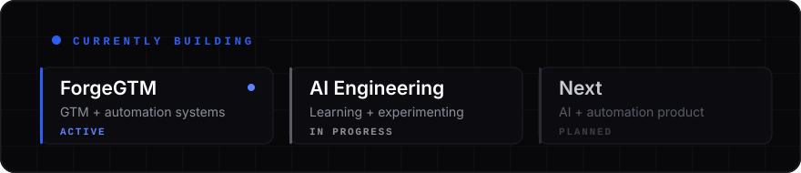
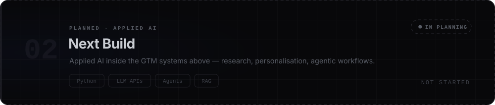
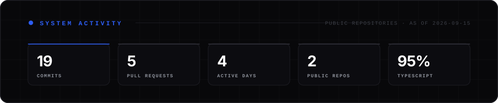

  

 

[`IDENTITY`](#identity) · [`MISSION`](#mission) · [`FORGEGTM`](#forgegtm) · [`AI ENGINEERING`](#ai) · [`SYSTEMS`](#systems) · [`PROJECTS`](#projects) · [`BUILD LOG`](#log) · [`ACTIVITY`](#activity) · [`CONNECT`](#connect)

 

  

 

<h2 id="identity"></h2>

I'm building **ForgeGTM**, a B2B go-to-market and outbound agency — and I write the software that runs it.

Most outbound doesn't fail for lack of effort. It fails because the system behind it is broken: lists bought instead of researched, messaging written for nobody in particular, deliverability quietly failing while the dashboard looks fine. Those are **engineering problems as much as creative ones**, which is exactly why I ended up on both sides of the work.

<table>
<tr>
<td width="50%" valign="top">

**`→` &nbsp;The motion**

ICP definition · buying-signal research · email infrastructure · campaign architecture · messaging that earns a reply

</td>
<td width="50%" valign="top">

**`→` &nbsp;The system underneath**

I don't hand the build off. The targeting logic, the sending infrastructure and the software that captures and routes what comes back are all things I write — which is why the two columns keep collapsing into one job.

</td>
</tr>
</table>

<h2 id="mission"></h2>

Building AI-powered systems, automation and new technology at the intersection of **go-to-market** and **artificial intelligence**.

GTM is full of work that is judgement-heavy, repetitive and text-shaped — qualifying accounts, reading buying signals, writing a relevant first sentence at scale. That's the exact shape of problem modern AI systems are good at. I'm not moving toward AI because it's the thing to do; I'm moving toward it because I keep hitting the wall where my GTM systems need it.

  

<h2 id="forgegtm"></h2>

  

> **Qualified pipeline, built on outbound systems.**
> ForgeGTM builds and runs outbound for B2B companies — targeting, infrastructure, messaging and campaigns — so sales teams spend their time in qualified conversations instead of building lists.

`B2B SaaS & technology` &nbsp;·&nbsp; `Series A–C` &nbsp;·&nbsp; `DACH, UK & Nordics`

### The system, in three pillars

<table>
<tr>
<td width="33%" valign="top">

`01`

**Strategy & Targeting**

Decide who is worth contacting before spending a euro reaching them.

Outbound Strategy · ICP & Targeting · Buying-Signal Research

</td>
<td width="33%" valign="top">

`02`

**Infrastructure & Deliverability**

Make sure what you send actually reaches a human inbox.

Email Infrastructure · Deliverability · Campaign Strategy

</td>
<td width="33%" valign="top">

`03`

**Messaging & Pipeline**

Turn attention into qualified conversations a team can close.

Personalized Copywriting · Lead Generation · Pipeline Generation

</td>
</tr>
</table>

### How an engagement runs

| | Stage | What happens | Output | |
|:--|:--|:--|:--|:--|
| `01` | **Research** | ICP, buying committee, live-signal accounts | ICP & account list | `Week 1–2` |
| `02` | **Build** | Targeting, messaging, sending infrastructure, warm-up | Live infrastructure | `Week 2–4` |
| `03` | **Launch** | Campaigns live, replies routed, volume paced | Booked meetings | `Week 5` |
| `04` | **Optimize** | Test against real reply data, expand what works | Compounding pipeline | `Ongoing` |

<b>&nbsp;→&nbsp; What I've actually shipped for it</b> &nbsp;(the engineering detail)

 

The ForgeGTM platform is a real production codebase, not a landing page:

- 🌍 **Fully bilingual (EN/DE)** — locale dictionaries type-locked to each other, so the build fails if a translation drifts out of sync
- 🗄️ **Postgres lead pipeline** — idempotent schema, documented migrations, indexed for the way the queue is actually read
- 📬 **Dual email transports** — Gmail SMTP *or* Resend, auto-selected by which credentials are present
- 🛡️ **Failure-tolerant by design** — internal alert and prospect confirmation tracked with separate timestamps, so a failed send never silently loses a lead
- 🔐 **Protected lead dashboard** — `/admin` behind HTTP Basic, `noindex`, never cached, and it 503s rather than falling open when unconfigured
- ✅ **Real server-side validation** — free-email-domain rejection, URL normalisation, typed per-field error keys
- 🔎 **Full SEO surface** — sitemap, robots, generated Open Graph images, canonical origins, hreflang alternates
- 📤 **Lead CSV export** — the dashboard queue exports straight out for whoever works it
- 🪟 **Strategy call as a modal** — the form opens in place from every CTA rather than sending visitors to a separate page
- 👤 **Team/founder section** — driven from content, so it stays translatable like the rest of the site
- 🧪 **Credential checker** — `scripts/check-email.mjs` verifies the mail setup before a real lead depends on it
- 📚 **8 long-form insight articles + 3 case studies**, written in both languages

⚖️ Every case study on the site is explicitly labelled as illustrative, and placeholder content carries a visible badge. I'd rather ship an honest placeholder than an invented client.

<h2 id="ai"></h2>

I'd rather state this plainly than decorate it: **I am not an AI engineer yet.** There is no AI code in my repositories, and I'm not going to badge myself with skills I can't show you. Here's the real state of it.

  

<table>
<tr>
<td width="33%" valign="top">

`● ` **BUILDING**

Shipped, and public.

Production TypeScript · Next.js App Router · Postgres · server actions · automated email workflows · internal tooling · bilingual delivery

**Status:** live in `forgegtm`

</td>
<td width="33%" valign="top">

`◐ ` **LEARNING**

In progress, no shipped artifact yet.

Python for AI work · LLM APIs · prompt design · tool-calling and agent patterns · retrieval fundamentals

**Status:** learning, not claiming

</td>
<td width="33%" valign="top">

`○ ` **NEXT**

Planned, not started.

AI-assisted ICP research · agentic outbound workflows · RAG over sales knowledge · open-source AI tooling

**Status:** on the roadmap

</td>
</tr>
</table>

This section gets updated as things actually ship. If something is in <b>Learning</b> or <b>Next</b>, it means there is nothing to show yet.

<h2 id="systems"></h2>

💡 The dimmed row is deliberate. Everything above it is in a repository you can open; everything in that row is something I'm still learning.

<h2 id="projects"></h2>

   

Live from the repository — these numbers move on their own.

🧱 Two slots, shown honestly — one shipping, one deliberately empty. More land here as they ship, not before.

<h2 id="log"></h2>

What actually landed, grouped by day, most recent first. Generated from commit history by a GitHub Action rather than written by hand, so it cannot quietly drift out of date the way a changelog does.

<!-- BUILD-LOG:START -->

| Day | What shipped | Commits |
|:--|:--|--:|
| `2026-09-15` [`KathiriyaHardik`](https://github.com/KathiriyaHardik/KathiriyaHardik) [`forgegtm`](https://github.com/KathiriyaHardik/forgegtm) | Drop the streak card from the activity section Build the activity card from public REST instead of contributionsCollection Rebase and retry when the build-log push races another commit Add build-log and activity-card workflow + 7 more | `11` |
| `2026-09-13` [`KathiriyaHardik`](https://github.com/KathiriyaHardik/KathiriyaHardik) [`forgegtm`](https://github.com/KathiriyaHardik/forgegtm) | Rebuild the profile as a designed system rather than a README Render the ForgeGTM mark statically in the banner Add profile README, brand assets and contribution snake Add lead emails, protected dashboard, SEO routes and content | `4` |
| `2026-09-12` [`forgegtm`](https://github.com/KathiriyaHardik/forgegtm) | Add EN/DE, case study and insights pages, and lead alert emails Reposition as an outbound agency and ship a working strategy-call form | `2` |
| `2026-09-11` [`forgegtm`](https://github.com/KathiriyaHardik/forgegtm) | Standardize on pnpm and unblock installs Replace unverified social proof and add real legal pages | `2` |

Last 4 days of work &#183; 19 commits &#183; merges excluded &#183; regenerated daily by GitHub Actions, never hand-written.
<!-- BUILD-LOG:END -->

<h2 id="activity"></h2>

 

 

 

<picture>
  <source media="(prefers-color-scheme: dark)" srcset="https://raw.githubusercontent.com/KathiriyaHardik/KathiriyaHardik/output/snake-dark.svg" />
  
</picture>

Regenerated every 12 hours by GitHub Actions from the live contribution graph.

<h2 id="connect"></h2>

Building ForgeGTM in Stuttgart. Open to conversations about **B2B outbound**, **GTM systems**, and **applied AI in go-to-market** — and happy to talk with anyone walking a similar path from building into AI engineering.

 &nbsp; 

 

### Building systems today. Engineering intelligence for tomorrow.

`ForgeGTM` &nbsp;·&nbsp; `AI Engineering` &nbsp;·&nbsp; `Automation`

Research → Build → Launch → Optimize Nothing on this page is claimed before it ships.

 

